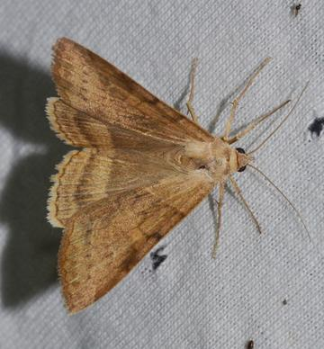

# [Helicoverpa zea](https://www.ncbi.nlm.nih.gov/datasets/taxonomy/7113/)

## Краткое описание организма

|                     | Значение | 
|--------------------:|---------:|
| Scaffold N50        | 12.8 Mb  |
| GC percent          | 37       |
| Genes               | 16988    |
| Genome size         | 375.2 Mb |
| Pubmed publications | 930      |

Кукурузная гусеница встречается в умеренных и тропических регионах Северной Америки, за исключением северной Канады и Аляски, поскольку она не может зимовать в этих регионах. Они регулярно мигрируют из южных регионов в северные в зависимости от зимних условий. Также встречаются на Гавайях, островах Карибского моря, в Китае и в большей части Южной Америки, включая Перу, Аргентину и Бразилию. Оптимальная температура роста - 18-24°С, не зимует в регионах с температурами ниже 10 °C.

Кукурузная гусеница является крупным сельскохозяйственным вредителем, с широким кругом хозяев, охватывающим кукурузу и многие другие сельскохозяйственные культуры.

## Распределение структур по геному

| Участок |G4                           |zhunt |zdnabert                                     |G4_prob              |zhunt_prob         |zdnabert_prob        |
|------|-----------------------------|------|---------------------------------------------|---------------------|-------------------|---------------------|
|exon  |1722                         |269443|27074                                        |0.10675759454432734  |0.16679408427390224|0.2830409601271248   |
|intron|7923                         |802370|37805                                        |0.4911965282083075   |0.4966934357131228 |0.3952265456750371   |
|upstream|449                          |53385 |2858                                         |0.027836329820210788 |0.03304707188148243|0.029878520500972255 |
|downstream|62                           |9514  |364                                          |0.0038437693738375698|0.00588947910237752|0.0038053818972546886|
|intergenic|5974                         |480711|27553                                        |0.3703657780533168   |0.29757592902911495|0.2880485917996111   |

| Участок |G4                           |zhunt |zdnabert                                     |G4_prob             |zhunt_prob         |zdnabert_prob      |
|------|-----------------------------|------|---------------------------------------------|--------------------|-------------------|-------------------|
|exon  |2949                         |29436 |38960                                        |0.012168301348044778|0.12146019616176537|0.16075856918271433|
|intron|5598                         |28187 |12458                                        |0.053896885380060655|0.271381119722717  |0.11994415828238579|
|upstream|613                          |5235  |2895                                         |0.03660575659859071 |0.31261196703690436|0.1728771049802938 |
|downstream|100                          |1273  |443                                          |0.005971575301564553|0.07601815358891675|0.02645407858593097|
|intergenic|2997                         |7488  |5395                                         |0.220903663300656   |0.5519274710695069 |0.3976560772462593 |

Видим, что детерминированный `zhunt` нашел в ~ 22 раза больше Z-ДНК, чем недетерминированный `zdnabert`.

Но процентное содержание у них почти во всех участках очень близкое.

## Гены, отвечающие за эпигенетику

Я заполнял таблицу для всех найденных семейств, тут приложу 6 первых строк и 4 используемых в командной части. 

Полную версию таблицы можно посмотреть в репозитории (файл family_gene_coordinates.csv).

|Проверяемое семейство|Название гена                |Координаты гена|
|---------------------|-----------------------------|---------------|
|G-patch              |LOC124642136                 |-9536932:9539124|
|DnaJ                 |LOC124631036                 |+6866203:6872361|
|Forkhead_N           |LOC124640167                 |+7495331:7496383|
|zf-UBP               |LOC124636933                 |-3246885:3251865|
|Peptidase_M24        |LOC124636257                 |-5302440:5310455|
|USP7_ICP0_bdg        |LOC124632881                 |+8796771:8811612|
|Helicase_C           |LOC124639944                 |+3079920:3084452|
|JAB                  |LOC124631187                 |-2298652:2307467|
|GATA                 |LOC124630297                 |-4382459:4465532|
|HLH                  |LOC124644660                 |-5861152:5873887|

## Используемый код

Используемый код можно посмотреть в ноутбуках в папке source.

## Геном

Последовательность можно скачать по ссылке: https://ftp.ncbi.nlm.nih.gov/genomes/all/GCF/022/581/195/GCF_022581195.2_ilHelZeax1.1/GCF_022581195.2_ilHelZeax1.1_protein.faa.gz
